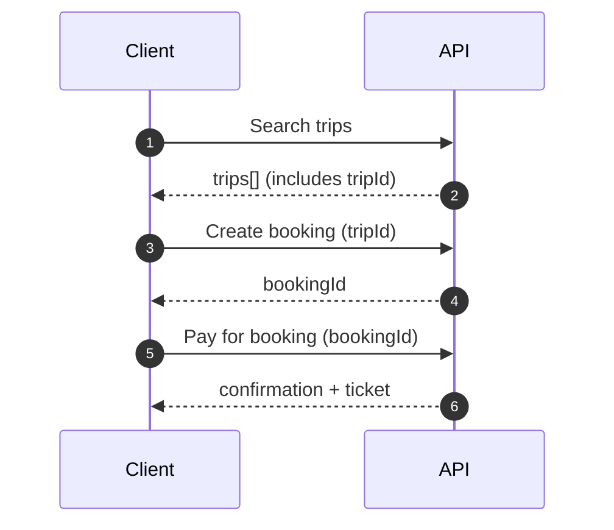
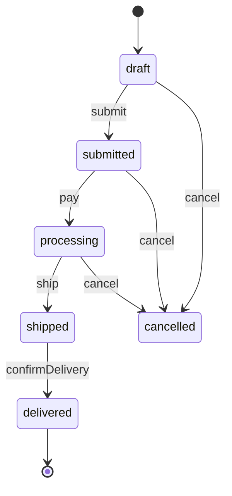

- TOC
{:toc}

HTTP/REST APIs generally are not just data stores, they usually act more like state machines moving users/clients through various workflows. Despite this, most APIs are designed, documented, and tested as if every request is independent of everything else.

REST APIs specifically attempted to solve this problem through HATEOAS (Hypermedia As The Engine Of Application State) being a core principle allowing clients to navigate through application states via links provided in responses. The trend never really caught on at large, but the problem of helping clients navigate through APIs has never been fully solved. This has lead to API clients generally stumbling around in the dark, hoping there is some manually maintained documentation explaining how to move from one state to another, with the occasional code sample thrown in to help. Some of this might even be up-to-date.

In a world where agentic-AI is becoming more prevalent, this problem is only getting worse. Instead of human developers stumbling around in the dark, we now have AI agents fumbling around trying to figure out how to use APIs to accomplish tasks on behalf of users. These agents need clear, unambiguous instructions on how to navigate through API workflows, including handling errors and edge cases.

Defining these workflows outside of the API itself helps provide clarity to this classic problem, avoiding confusing the client by shoving state controls into the runtime data models and headers. Instead they can be defined in a separate document that references the API definitions, describing how to use them together to accomplish real-world tasks.

The Arazzo Specification provides a standardized way to define these API workflows, making them machine-readable and executable, and the way it extends OpenAPI means the schemas are right there for humans and agents to work with, with the schema and validation rules helping to cut down on hallucinations.

Using Arazzo not only solves the documentation problem, but also drastically improves the process of design, governance, end to end testing, chaos testing, and all sorts of operational challenges like monitoring and health checks.

## Documentation Benefits

An API client needs to do a thing: book a ticket, onboard a user, move an order from "draft" to "paid", or recover when something fails halfway through.

There probably is not a `POST /moveOrderFromDraftToPaid` endpoint (and if there is there shouldn't be). Instead there are a series of steps that need to be taken in order, with data flowing from one step to the next, and various failure modes that need to be handled along the way.

Arazzo can be used to capture the journey step-by-step, with the same kind of clarity OpenAPI brought to individual operations. When you write a workflow with good descriptions and sensible outputs, you've effectively created a living "how to use this API" guide that tools can render, validate, and even execute.

Here's what that kind of story looks like, at a high level:



And here's the same idea expressed as an Arazzo workflow snippet. Notice how the important part isn't the syntax; it's the fact that the workflow makes the data handoff explicit.

```yaml
workflows:
  - workflowId: complete-booking-flow
    summary: Test the full booking process
    steps:
      - stepId: search
        operationId: search-trips
        successCriteria:
          - condition: $statusCode == 200
          - condition: $response.body.trips.length > 0
        outputs:
          tripId: $response.body.trips[0].id
        
      - stepId: book
        operationId: create-booking
        requestBody:
          payload:
            tripId: $steps.search.outputs.tripId
        successCriteria:
          - condition: $statusCode == 201
          - condition: $response.body.status == 'confirmed'
```

If you've ever maintained "getting started" docs, you'll know the pain: they're the first thing users read and the first thing that goes stale. Arazzo helps because you can treat workflows as the canonical version of those journeys, then generate docs and examples from the same source.

Common workflows could involve: 

- log in
- getting a user id number
- using that user id to find resources
- creating new resources
- knowing if that worked or failed

It seems like it should be pretty standard stuff, but every API is different and these journeys are often surprisingly confusing to navigate without clear documentation that's definitely up-to-date.

## Testing Benefits

Once workflows are written down in a machine-readable format, testing stops being a separate project. The workflow itself becomes the test: run it against staging in CI, run it as a smoke test before deploy, or run it periodically as monitoring.

Where Arazzo gets especially interesting is state. Many APIs behave like state machines, but they're documented as if every request is independent. Arazzo gives you a place to express state transitions as something deliberate and testable.

Here's the idea in the abstract:



And here's what that looks like when you're checking the transitions with actual API calls:

```yaml
workflows:
  - workflowId: order-lifecycle
    summary: Complete lifecycle of an order from draft to delivered
    
    steps:
      - stepId: createDraft
        description: Create order in draft state
        operationId: createOrder
        successCriteria:
          - condition: $response.body.state == 'draft'
      
      - stepId: submitOrder
        description: Transition from draft to submitted
        operationId: submitOrder
        parameters:
          - name: orderId
            value: $steps.createDraft.outputs.orderId
        successCriteria:
          - condition: $response.body.state == 'submitted'
      
      - stepId: processPayment
        description: Process payment, moving to processing state
        operationId: processPayment
        successCriteria:
          - condition: $response.body.state == 'processing'
          - condition: $response.body.paymentStatus == 'paid'
      
      - stepId: ship
        description: Ship the order
        operationId: shipOrder
        successCriteria:
          - condition: $response.body.state == 'shipped'
        
      - stepId: confirmDelivery
        description: Final state transition to delivered
        operationId: confirmDelivery
        successCriteria:
          - condition: $response.body.state == 'delivered'
```

Instead of being locked away in some cloud testing environment or hidden QA repository for only a select few to see, the criteria for success and failure become easily visible and knowable to everyone. 

New team members can read the workflow and understand the valid transitions. QA can execute the same workflow as an end-to-end test. When a rule is changed (say you add a "refunded" state), you update one workflow and let tooling catch the places that no longer match. This can be done along with the code changes in a single pull request, making reviews and validation much simpler.

You can also handle real-world edge cases without turning your docs into a wall of prose. For example: "cancel is allowed in three states, but if it's already shipped you need to start a refund flow instead".

```yaml
- stepId: cancelOrder
  description: Cancel order - allowed from draft, submitted, or processing states
  operationId: cancelOrder
  successCriteria:
    - condition: $statusCode == 200
    - condition: $response.body.state == 'cancelled'
  
  # This step can be reached from multiple prior states
  dependsOn:
    - createDraft
    - submitOrder  
    - processPayment
  
  # Only execute if certain conditions are met
  onFailure:
    - name: orderAlreadyShipped
      type: goto
      stepId: refundProcess
      criteria:
        - condition: $response.body.reason == 'ORDER_SHIPPED'
```

## Design, Governance, and Operations

Once you've got a handful of core workflows, they naturally become a contract for how the API should be used. That helps during design reviews. Can a customer actually complete checkout with this API? Did a recent change break a critical journey?

Operationally, workflows are useful as smoke tests and as synthetic monitoring. This is different from a classic “is the service up?” health check: you’re not trying to prove the database is reachable, you’re trying to prove the product still works.

If your “signup → create resource → view resource” journey is broken, your API might still be returning 200s all day long, but your users are stuck. Arazzo lets you encode that journey once and run it on a schedule (usually against a sandbox or a dedicated test tenant).

Here’s a compact example of a synthetic canary workflow you might run in CI or periodically in a monitoring job:

```yaml
workflows:
  - workflowId: canary-happy-path
    summary: Validate a critical user journey end-to-end
    steps:
      - stepId: authenticate
        operationId: getToken
      - stepId: createResource
        operationId: createItem
      - stepId: readBack
        operationId: getItem
      - stepId: cleanup
        operationId: deleteItem
```

Even if you never generate a fancy visualization as documentation, the day-to-day payoff is simple: onboarding is faster when people can run the workflow and watch it work; integration is smoother when the happy path is explicit; and breakages are easier to spot because failures show up as a specific step, with a specific condition that didn't match.

## Cross-API Orchestration

While OpenAPI describes a single API, Arazzo can orchestrate across multiple APIs by referencing multiple source descriptions. This is especially useful for documenting and testing business processes that span different APIs or services.

```yaml
sourceDescriptions:
  - name: paymentApi
    url: ./payment-api.yaml
  - name: inventoryApi
    url: ./inventory-api.yaml
  - name: shippingApi
    url: ./shipping-api.yaml

workflows:
  - workflowId: complete-order
    steps:
      - stepId: reserveInventory
        operationId: $sourceDescriptions.inventoryApi.reserve
      
      - stepId: processPayment
        operationId: $sourceDescriptions.paymentApi.charge
        
      - stepId: scheduleShipping
        operationId: $sourceDescriptions.shippingApi.schedule
        onFailure:
          - name: releaseInventory
            type: goto
            stepId: rollbackInventory
```

Notice the difference in `operationId` syntax. Instead of referencing just the operationId (e.g.; `reserve`), a longer runtime expression is used which references the API in the source descriptions as a prefix: `$sourceDescriptions.inventoryApi.reserve`.

This is where Arazzo starts to feel more like CI/CD workflows, but for business journeys. Stitching together operations that live in different services, showing pass data between them, and defining what "success" means for the whole sequence.

## Business Value

Beyond making sure your API ecosystem is actually functioning properly (with fewer partial sources of truth to disagree with each other) most of the business value is second-order effects. 

- Properly documented flows lead to fewer support requests from confused client developers struggling to integrate.
- Reduced chances of AI agents flailing around hallucinating incorrect API usage.
- More confidence when you ship changes because you can run the same workflows as regression tests.
